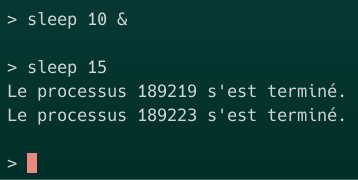
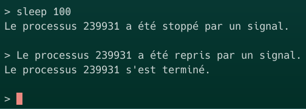
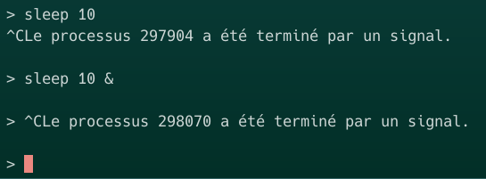
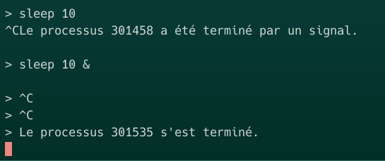
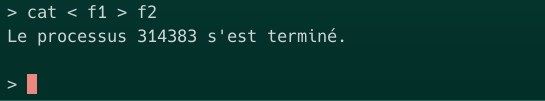
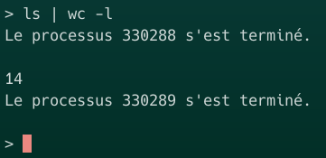
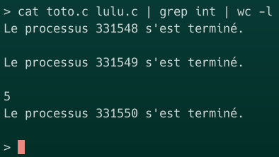

# <u>Rapport du projet minishell</u>
## Ragot Cyrian, Groupe K
---

Ce rapport reprends progressivement les étapes du projet, certaines implantations expliquées dans les premières étapes ne sont donc pas forcément en accord avec le code du projet final. 

## <u>Partie 1 : Processus et boucle principale</u>

### Etapes 1-2 :
Utilisation de ```execvp``` pour lancer la commande.
Il faut la lancer dans un processus fils (utilisation de ```fork```) car cette commande remplace le code du programme.
Pour le moment, la terminaison de la commande n'est pas attendue par le minishell. On peut par exemple faire un ```ping enseeiht.fr``` qui va écrire dans le terminal en continu, et remarquer que le minishell demande directement une nouvelle commande avec ```>``` alors que la commande ```ping``` affiche toujours dans le terminal.

### Etape 3 :
Pour éviter ce problème nous allons enchaîner séquentiellement les commandes, nous utilisons alors ```wait``` dans le code du père pour attendre la terminaison du processus fils. Maintenant, le lancement de toute commande 'bloque' le minishell jusqu'à la fin de l'execution de celle-ci.

### Etape 4 :
Cependant, nous souhaitons pouvoir lancer une commande en tâche de fond lorsqu'elle est suivie de ```&```. On place alors la condition ```commande->background == NULL``` avant le ```wait``` qui indique que le ```&``` n'a pas été positionné. Mais, en executant ```> sleep 10 &``` puis ```> sleep 50```, le caractère ```>``` s'affiche dans le terminal après 10s. Ce problème pourras être évité dans les prochaines étapes avec le traitement du signal SIGCHLD puis en définissant une variable globale au programme ```pid_avant_plan``` qui stocke le pid du processus en avant plan.

## <u>Partie 2 : Signaux</u>

### Etapes 5-6-7-8-9-10 :
Nous utilisons maintenant ```waitpid``` qui permet de rendre l'attente de la terminaison du fils non bloquante et de connaître l'état des processus fils. Nous ajoutons un handler pour le signal SIGCHLD pour traiter la terminaison des processus fils et afficher un message indiquant comment les processus sont arrêtés ou repris lorsqu'ils changent d'états. Nous utilisons aussi ```pause``` pour attendre l'arrivée d'un signal, en mettant donc ```waitpid``` dans le handler de SIGCHLD.
Voici un exemple illustrant ces fonctionnalités du shell :



Nous pouvons aussi tester l'envoie de signaux au processus fils. Pour cela on lance une commande ```sleep 50``` puis on stoppe le processus correspondant (on trouve son pid avec ```ps -fu```) avec ```kill -s 19 <pid>``` puis on reprends son execution avec ```kill -s 18 <pid>```. On obtient le résultat suivant.



## <u>Partie 3 : Contrôle du fils par les commandes au clavier</u> 

### Etape 12 :
Pour le moment, les signaux SIGINT et SIGTSTP, lancés par la commande ctrl+c et ctrl+z, arrêtent/stoppent le processus père minishell même lorsque des processus fils sont lancés en arrière plan ou en avant plan.

### Etape 13 :
La frappe de ctrl+c ou ctrl+z envoie un signal au minishell et tous ses processus fils. Or, nous ne voulons pas terminer ou stopper le minisheel mais seulement des processus fils. Pour cela, nous avons tester plusieurs solutions.

Solution 1 : le traitement des signaux est changé, on peut ne rien mettre dans le fonctions de traitement pour que ces deux signaux ne produisent pas d'effet.

Solution 2 : ignorer les signaux avec SIG_IGN, ceci est plus simple et moins brouillon que d'avoir des fonctions de traitement vides.

Solution 3 : masquer les signaux dans le processus père et les démasquer dans le fils

Après implémentation de l'une de ces solutions, les commandes ctrl+c et ctrl+z terminent/stoppent tous les processus fils mais jamais le minishell :



### Etape 14 :
Cependant seuls les processus en avant plan devraient pouvoir être sensibles aux commandes ctrl+c et ctrl+z. Nous allons alors mettre les processus fils en arrière plan dans une autre groupe pour qu'ils ne reçoivent pas ces signaux. Voici, le même test que l'étape 13, montrant bien que seul le processus en avant plan est impacté par ctrl+c (le processus en arrière plan se termine tout seul après les 10 secondes):



## <u>Partie 4 : Redirections des entrées/sorties</u>

### Etape 16 :
Ici nous implémentons la redirection des entrées et des sorties qui peuvent être effectuées avec ```<``` et ```>```. Nous utilisons les fonctions ```open```, ```dup2``` et ```close```. L'exemple suivant montre l'utilisation de cette fonctionnalité, le texte présent dans le fichier f1 sera écrit dans f2 par la commande ```cat``` :



## <u>Partie 5 : Pipe</u>

### Etapes 19-20 :
Maintenant, nous implémentons la fonctionnalité du pipe qui permet de lier plusieurs commandes pour enchaîner leurs entrées et sorties. Nous devons donc manipuler des tubes dans les processus fils et le processus père. Le premier exemple permet de compte le nombre de fichiers/dossiers du répertoire courant, en effet ```ls``` donne la liste des fichiers et dossiers et la commande ```wc -l``` compte le nombre de lignes. Le second exemple compte le nombre d'occurences de la chaîne de caractères ```int``` dans les fichiers toto.c et lulu.c donc trois processus sont créés et leurs entrées/sorties sont bien liées.



